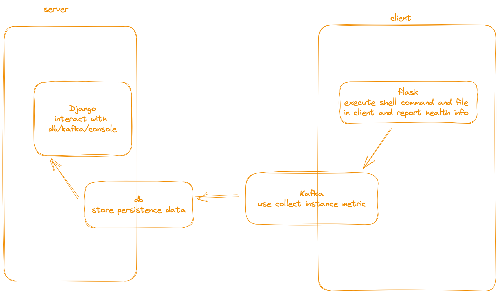

# PythonPro
a daily usage on my python life
## agent router
agent.py usage: python agent.py -s <BOOTSTRAP_SERVERS>, 
then you can send command to topic and client 
will receive then execute. 
wait three seconds or long time.
the result of command will send to other topic.  
timed task can use producer-consumer.
use socket method for this scene.  
or use web application. start web server in client.
register web info on server in start up.  
then we know those server online.  
and server can use some health probe to monitor agent status.  

i think can use fastapi in client, and use django in server  
don't operate anything, just report system info  
and server easy implment anything use django  

schedule task to get vm info  

## implement health monitor

use django-apscheduler implement timely task  
Q. restart django server and will start new schedule task. it's name like before task.  
A. remove schedule task when restart server  

Q. can't import module from other dir  
A. move cron_task and wsgj file in one folder  

## instance metrics
cpu_usage,disk_usage,collect_time, use echarts to display these data  
use echarts to display data  

## upload shell script to client
1. use ssh  
2. use fastapi  
3. 

## kafka-rest-proxy  
can't use kafka-rest-proxy in these dockers. maybe will change docker instance in the future 

basic info

# Kafka Cluster
use `docker/docker-compose.yaml` fast build zk and kafka cluster then use `docker-compose up` run kafka cluster

# Develope Guide
## Project Folder
* shell  
  shell script that collect host info.
* md_image  
  some images used in markdown document 
* docker  
  compose file about docker
* agentserver  
  a django project as server, interact with database and kafka
* backend  
  fastapi project and use in client. aim to fast and lightweight build app.
  fastapi run in host. so it expose health check api, exec cmd api, exec shell script api and
  upload file api. 
  * how to implement upload file to destination host?   
    in server use pick shell script then send a request. select file to upload in console,
    then choose one host that would upload host ip. click send is done.
    

# resource pool
## base image
use docker to deploy host with agent. Auto management. health check and report instance status.  
we can select image to deploy server, implement by docker-compose.
current use alpine to build base image and install python.

## generalize 
use django as server  
use fastapi as client  
client report host info and execute shell script, return res to kafka, schedule task 
consume data and persistence data in db.

# client agent
* health check api
* install plugin api
* report host info api
* execute shell command api
* execute shell script api
* deploy host
  * use `docker build -t agent .` to build image and `docker run -d -p 8000:8000 agent` to run server.

# console page
* execute shell command and get result
* display host metric by search ip
* select local shell file and ip to uplaod